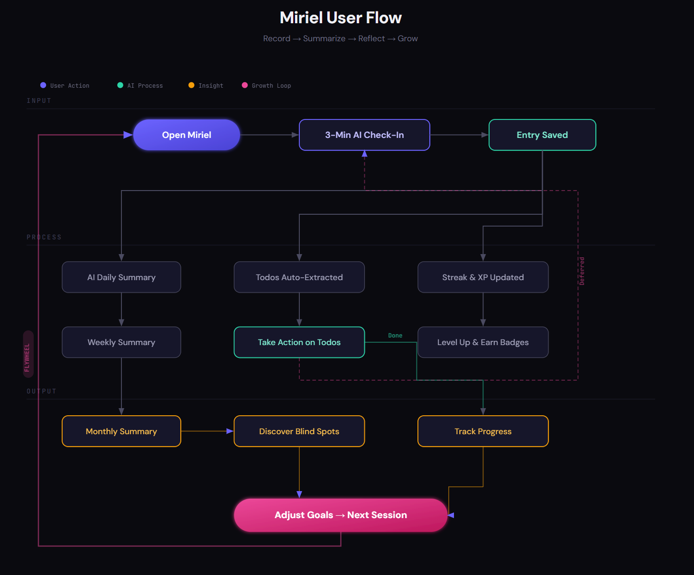
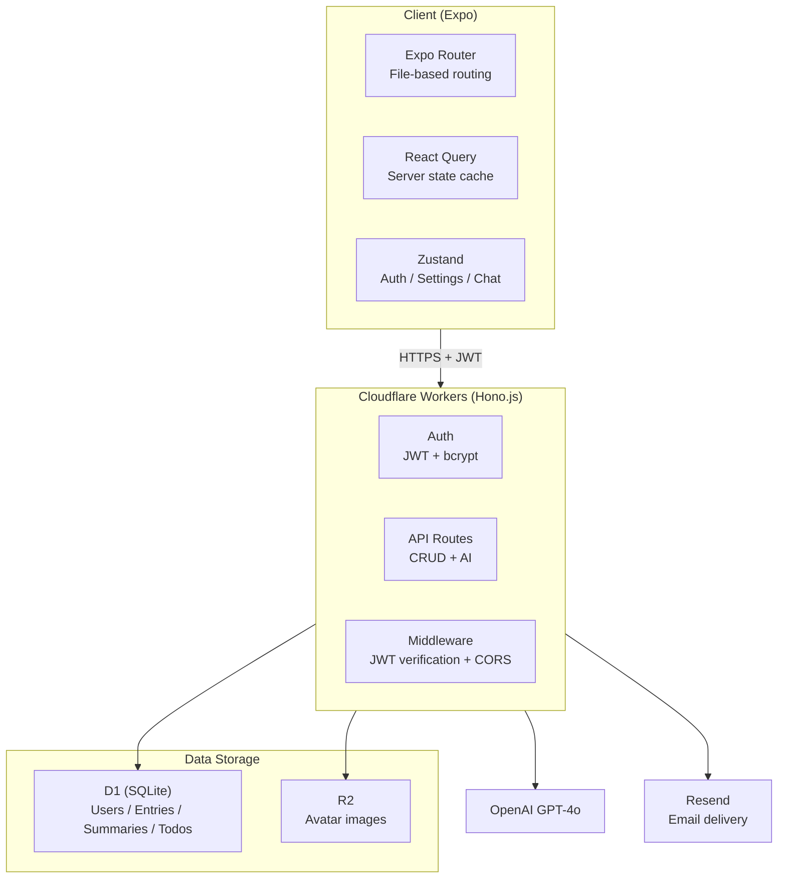

# **Miriel: AI-Powered Journal**

> **3 minutes a day. Just answer. AI records your growth.**
> What starts as personal reflection becomes organizational intelligence.

Miriel is an AI-powered journaling app for anyone who wants to grow through reflection, without the effort. Record your day in a quick conversational check-in, and Miriel automatically generates summaries, extracts action items, and surfaces patterns. Every insight linked back to your original entry.

**Live**: [miriel.app](https://miriel.app) · **Vision & Roadmap**: [VISION.md](VISION.md)

---

## **Why Miriel?**

Knowledge workers, students, creators, managers. Anyone with a busy schedule generates countless thoughts and notes but rarely reviews them. Existing journaling apps either demand too much effort or produce AI summaries you can't trust.

Miriel takes a different approach: **a 3-minute AI-guided conversation** replaces the blank page, and **every AI-generated sentence links back to its source entry**, so you can always verify what you actually wrote.

---

## **User Flow**

**① Open → AI Check-In (3 min)** — AI guides you through three stages: Plan → Detail → Reflect. You just answer.

**② Entry Saved → Auto-Processing** — The moment an entry is saved, three things happen simultaneously: daily summary generation, automatic todo extraction, and streak/XP updates.

**③ Morning Dashboard (30 sec)** — The next morning, todos extracted from yesterday's entry appear on your dashboard. Complete them or defer to the next session.

**④ Review Chain (Automatic)** — Daily summaries build into weekly reviews; weekly reviews build into monthly reviews. Recurring patterns, energy trends, and unresolved blockers surface automatically.

**⑤ Adjust Goals → Loop Back** — Insights from monthly reviews inform goal adjustments, feeding into the next check-in. The flywheel of **Record → Summarize → Reflect → Grow** keeps turning.

---

## **Core Features**

| Feature | Description |
|---|---|
| **Conversational Journaling** | AI guides a 3-phase check-in (Plan → Detail → Reflection). No blank-page anxiety |
| **Evidence-Linked Summaries** | Daily, weekly, and monthly reviews where every sentence traces back to its source entry |
| **Smart Organization** | Auto-tagging (projects, people, issues) and AI-extracted todos with source links |
| **Gamification** | Duolingo-style streaks, XP, levels, and badges to build a lasting habit |
| **AI Personalization** | Customizable summary style, focus areas, and persona-aware responses |
| **AI Agent Platform** | Dedicated reflection service for AI agents. Agents log decisions, evaluate outcomes, and refine goal-directed strategies via API |
| **Privacy-First** | Custom auth, no third-party tracking, full data export, permanent account deletion |

---

## **Tech Stack**

| Layer | Technology | Why |
|---|---|---|
| Client | Expo (React Native) + TypeScript + Expo Router | Single codebase for Web, iOS, Android |
| Styling | NativeWind (Tailwind CSS) + Dark mode | Rapid UI development + responsive design |
| State | React Query (server) + Zustand (client) | Clean separation of server cache and client state |
| Backend | Cloudflare Workers (Hono.js) · ~25 API routes | Edge computing, global low-latency, generous free tier |
| Database | Cloudflare D1 (SQLite) | Serverless SQL with migration support |
| Storage | Cloudflare R2 | S3-compatible, zero egress cost |
| Auth | Custom JWT + bcryptjs + email verification (Resend) | Full auth system with no third-party dependency |
| AI | OpenAI GPT-4o | Best-in-class multilingual understanding + structured output |
| i18n | i18next - Korean / English (auto-detect system locale) | Global expansion ready |

---

## **Architecture**

---

## **Responsive Design**

| Environment | Navigation | Layout |
|---|---|---|
| Desktop (1024px+) | Sidebar | Master-Detail (2-panel) |
| Mobile (< 1024px) | Bottom tabs + FAB | Single panel (fullscreen) |

Single codebase supports **Web (PC browser)**, **iOS**, and **Android**.

---

## **Screens**

### **Tab Navigation (Main)**

1. **Dashboard (Home)** - Streaks, level/badges, recent summaries, quick record button
2. **Record** - AI chatbot check-in (3 phases) + text input
3. **Timeline** - Entry list by date + daily/weekly/monthly summary access
4. **Todo List** - AI-extracted todos + completion + source entry links
5. **Profile** - User info, achievements, account management, AI personalization

### **Detail / Modal Screens**

- **Entry Detail** - View/edit entry, regenerate summary (3/day limit)
- **Summary Detail** - Summary text with per-sentence evidence chips
- **Settings** - Language, theme, notifications, support, legal
- **Edit Profile** - Avatar upload/delete, persona fields
- **Onboarding** - 3-step interactive setup (growth cycle → weekly review config → notifications)

---

## **Data Model**

| Entity | Description |
|---|---|
| **User** | Account (email, username, metadata JSON) |
| **Entry** | Journal record (date, raw text, tags, summary regen count) |
| **Summary** | AI-generated summary (daily/weekly/monthly, per-sentence entry links) |
| **Todo** | AI-extracted action item (status, due date, source entry link) |
| **UserAiPreferences** | AI personalization (summary style, focus areas, custom instructions) |
| **RefreshToken** | JWT refresh token (30-day expiry, rotation) |
| **EmailVerification** | Email verification code (6-digit, expiry) |
| **LoginAttempt** | Login attempt record (5 per 15 minutes rate limit) |

---

## **AI Pipeline**

| Endpoint | Purpose | Details |
|---|---|---|
| `POST /ai/chat` | Conversational check-in | 3-phase conversation (Plan → Detail → Reflection), stateless |
| `POST /ai/tagging` | Auto-tagging | Extract project/people/issue tags |
| `POST /ai/generate-summary` | Daily summary | Summary + todo extraction in single AI call (3/day limit) |
| `POST /ai/generate-weekly` | Weekly review | 3-5 key points + source entry IDs |
| `POST /ai/generate-monthly` | Monthly review | 5-7 key points + source entry IDs |

All AI prompts are inline within Worker routes with 3x auto-retry and input sanitization.

---

## **Deployment**

| Service | URL | Platform |
|---|---|---|
| Web | [miriel.app](https://miriel.app) | Cloudflare Pages (Expo Web build) |
| API | [api.miriel.app](https://api.miriel.app) | Cloudflare Workers |
| Database | miriel-db (APAC) | Cloudflare D1 |
| Storage | miriel-avatars | Cloudflare R2 |

---

## **License**

Copyright (c) 2026 Arkenstone Labs. All rights reserved.

See [LICENSE](LICENSE) for details.
